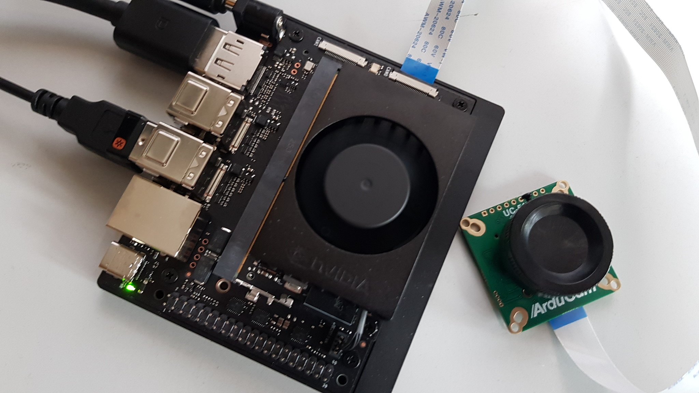

# BoTiKI SediDigi (based on Jetson Orin Nano)

## About the project
Soils are the foundation of terrestrial ecosystems. They provide essential ecosystem services such as the control of pathogens, food production, and more. Soil functioning leads to the storage or release of potent greenhouse gases (GHGs): CO₂, N₂O, and CH₄. The soil microbiome (fungi and bacteria) is considered the main driver of the production of these gases, which arise as by-products of its activity. The activity of the microbiome is regulated by the micro- and mesofauna: small invertebrates that either feed directly on microorganisms or consume dead organic matter. In the BoTiKI project, we aim to decipher the role of soil fauna and investigate its value as an indicator of GHG fluxes from soils.

Please see our [project website](http://botiki.org) for further information.

BoTiKI SediImager is a system for camera control and AI inference, designed for scientific imaging applications, executable on a Jetson Orin Nano.



### Features

TODO after finalisation

## Hardware

BoTiKI SediDigi is expected to run on a Jetson Orin Nano (Developer Kit)
equipped with

- NVMe SSD >= 1TB; currently used: Crucial P310 PCIe Gen4 NVMe M.2 SSD (CT1000P310SSD2), 1 TB) and
- ArduCam IMX477.


## Preparation
### Jetson Orin Nano

Do the initial setup using SDK Manager, according to [this tutorial](https://www.jetson-ai-lab.com/tutorials/initial-setup-sdk-manager/). Using a real host PC with a current Ubuntu (20.04 / 22.04) is highly recommended, make no use of virtual machines!

- Install the NVIDIA SDK Manager on the host (registration at the [NVidia Developer Network](https://login.developer.nvidia.com) is required to download it).
- Put the Jetson Orin Nano into recovery mode: Connect pins 9 and 10 with a jumper wire, then connect the Jetson Nano to the host via USB-C. 
- Launch the SDK Manager on the host, log in, select "Jetson Orin Nano Developer Kit" as the target device, and select the JetPack version (e.g., 6.x) as the target OS.
- Let the SDK Manager flash the board; this will install Jetson Linux (Ubuntu), NVIDIA drivers, CUDA, cuDNN, etc.
- After flashing: Boot Jetson normally and perform the Ubuntu initial setup.

Show the installed CUDA version:
```
nvcc --version
```

Show the installed L4T/JetPack version:
```
cat /etc/nv_tegra_release
```

### ArduCam IMX477

First have a glimpse at the introduction to Arducam Jetson Cameras [given here](https://docs.arducam.com/Nvidia-Jetson-Camera/Introduction-to-Arducam-Jetson-Cameras/).

The ArduCam must be connected to the CSI port cam0. The IMX477 is a Bayer sensor that typically requires the NVIDIA ISP pipeline on Jetson platforms. 
For accessing this sensor, proceed with the driver installation according to [this tutorial](https://docs.arducam.com/Nvidia-Jetson-Camera/Native-Camera/Quick-Start-Guide/#diagram-nvidia-jetson-orin-nano):

```bash
cd ~
wget https://github.com/ArduCAM/MIPI_Camera/releases/download/v0.0.3/install_full.sh
chmod +x install_full.sh
./install_full.sh -m imx477
```
After reboot, the video device `/dev/video0` should be available.

Images captured with the ArduCam IMX477 on Jetson Nano usually show a slightly blue tint. 
This can be fixed by replacing the default ISP calibration profile at `/var/nvidia/nvcam/settings/camera_overrides.isp` 
with the version given at [this repository](https://github.com/RidgeRun/NVIDIA-Jetson-IMX477-RPIV3).

Now view the pixel format via

```bash
v4l2-ctl --list-formats-ext
```

which should lead to the output similar to
```
ioctl: VIDIOC_ENUM_FMT
	Type: Video Capture

	[0]: 'RG10' (10-bit Bayer RGRG/GBGB)
		Size: Discrete 4032x3040
			Interval: Discrete 0.048s (21.000 fps)
		Size: Discrete 3840x2160
			Interval: Discrete 0.033s (30.000 fps)
		Size: Discrete 1920x1080
			Interval: Discrete 0.017s (60.000 fps)
```

For a simple image preview, try some of the following one-liners:

```bash
gst-launch-1.0 nvarguscamerasrc sensor_id=0 ! nvvidconv ! nvegltransform ! nveglglessink -e
```
```bash
gst-launch-1.0 nvarguscamerasrc sensor_id=0 ! "video/x-raw(memory:NVMM),framerate=21/1" ! nvvidconv ! nvegltransform ! nveglglessink -e
```
```bash
gst-launch-1.0 nvarguscamerasrc sensor-id=0 ! 'video/x-raw(memory:NVMM), width=1920, height=1080, format=NV12, framerate=30/1' ! nvvidconv ! videoconvert ! autovideosink
```

Please note: nvarguscamerasrc is specifically for MIPI CSI-2 cameras connected through the Jetson CSI interface (not USB cameras). 

For capturing a video, type:

```bash
sensor_id=0 # 0 for CAM0 and 1 for CAM1 ports 
Framerate=30 
gst-launch-1.0 nvarguscamerasrc sensor_id=$sensor_id ! "video/x-raw(memory:NVMM),width=1920,height=1080,framerate=$Framerate/1,format=NV12" ! nvvidconv flip-method=0 ! "video/x-raw,width=960,height=720" ! nvvidconv ! nvegltransform ! nveglglessink -e
```

## Installation

Open a terminal on your computer and go to the folder where you want to save this project.
Run:

```bash
git clone https://github.com/a-seeliger/SediDigi.git
```

Enter the new folder:

```bash
cd SediDigi
```

The repository is now cloned and ready to use. 


## Project Structure
```
SediDigi/  
├── bg_led/               # Control a 5x5 or 8x8 LED matrix panel 
├── bg_oled/              # Control a OLED display module (obsolete) 
├── bg_tft/               # Control a TFT display module (obsolete)
├── bg_tft_lit/           # Control a TFT display with dimmable backlight (obsolete)
├── capture/              # Cam capture implementations (shell scripts, C++, Python)  
├── extras/               # Some (mostly non-essential) extras  
├── haptic/               # Control a haptic driver module
├── inference/            # AI inference (first benchmark tests)
├── meas/                 # Quantitative measurements (shape, focus, ...)
├── opencv_build/         # Scripted OpenCV build with full CUDA support
├── segmentation/         # Image segmentation
├── static/               # CSS and static assets  
├── templates/            # Templates for documentation
└── utils/                # Helper utilities in development 
```

## Roadmap

Planned features and improvements:

- [x] capturing images from ArduCam in a OpenCV compatible format in Python
- [x] simple library for accessing Arducam, quite similar to the libcamera2 package, implemented in Python
- [x] control OLED display module
- [x] control TFT display module
- [x] control TFT display module with adaptable background light
- [x] control a 5x5 / 8x8 LED matrix panel 
- [x] Jetson Nano port of the RPi5 haptic motor driver (vibration module control)
    - [x] control up to four haptic motor driver via I2C multiplexer
- [ ] porting/implementing/optimising SediDigi capture function in C++
    - [x] add CLI flags for temporal noise reduction (TNR) / TNR strength / edge enhancement
    - [x] implementation using **software encoding** (fallback)
    - [x] include chromatic segmentation
    - [x] include morphological operators etc.
- [ ] ...see [Trello](trello.com/b/3fJMIKId/botiki) for more.

## Troubleshooting

Q: After a (re)configuration of the 40 pin header using the script `/opt/nvidia/jetson-io/jetson-io.py`,
the Arducam IMX477 is not working anymore. Any capturing attempts lead to error messages or early programm terminations.
 
A: The script `jetson-io.py` always applies the configurations made by the user automatically, which doesn't always work correctly. Very likely, the reference to the device tree overlay for the Arducam IM477 got lost in `/boot/extlinux/extlinux.conf`, the configuration file for boot options and kernel start parameters. So make sure that its last entry looks as follows:

```
    OVERLAYS /boot/arducam/dts/tegra234-p3767-camera-p3768-imx477-dual.dtbo,/boot/jetson-io-hdr40-user-custom.dtbo
```

If necessary, edit this entry as a superuser accordingly and reboot the Jetson Orin Nano.


## Contributing

Contributions are welcome! Please follow these guidelines:

1. **Code Style:** Follow PEP 8 for Python code
2. **Testing:** Test any changes thoroughly before submitting
3. **Documentation:** Update relevant documentation when adding features
4. **Commits:** Use clear and descriptive commit messages

To contribute, please contact the project maintainer or submit a pull request.

## License

MIT License

Copyright (c) 2026 André Seeliger, Hochschule Zittau/Görlitz

## Contact

### Dr.-Ing. Dipl.-Inf. (FH) André Seeliger  
IPM project manager / scientific assistant  

Hochschule Zittau/Görlitz  
Institut für Prozesstechnik, Prozessautomatisierung und Messtechnik (IPM)  
Fachgebiet Kerntechnik/Soft Computing  
Theodor-Körner-Allee 16  
02763 Zittau  

Mail: a.seeliger@hszg.de  
Web: https://ipm.hszg.de

### Frank Zacharias
technician  

Hochschule Zittau/Görlitz  
Fakultät Elektrotechnik und Informatik  
Hochwaldstr. 2a  
02763 Zittau  

Mail: f.zacharias@hszg.de  

