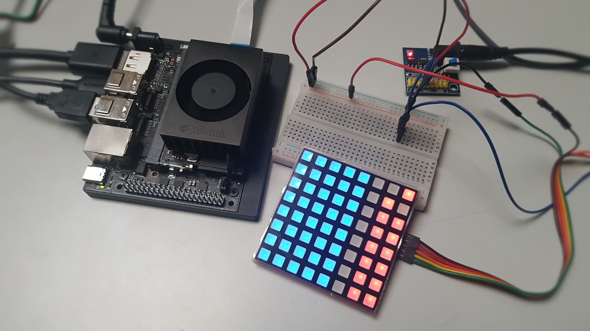
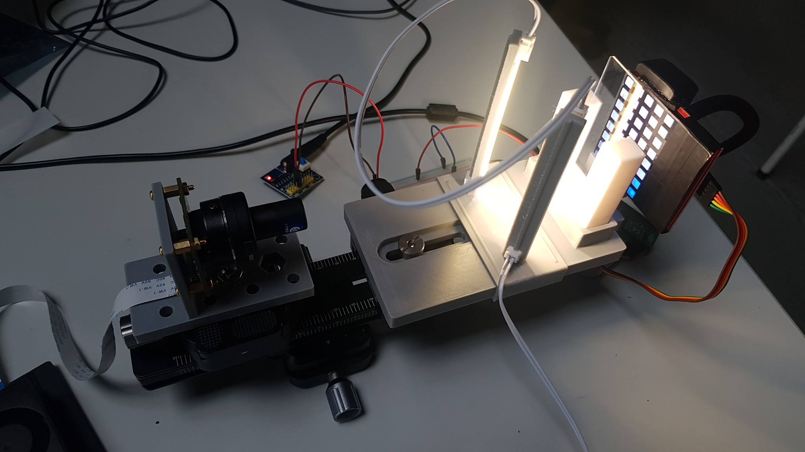

# SediDigi/bg_led/pico_hc595

MicroPython driver for an **8x8 RGB LED matrix** built from **4x 74HC595**
(the "LED Matrix 1.0" module), driven by a **Raspberry Pi Pico 2 (W,
RP2350)** and controlled over USB Serial from a Jetson Orin Nano.



The intended use is an adaptive color background: the matrix is refreshed
continuously by PIO + DMA at a high cadence (≈1389 Hz), but the time-sliced
burst structure still produces rolling-shutter banding at short exposures;
see "Practical Test and Conclusion" below.

> **Requires a Pico 2 / Pico 2 W (RP2350).** The refresh loop uses the
> RP2350 DMA layout (register/bit positions differ from the RP2040).
> MicroPython **≥ v1.23** (first RP2350 release) is required.

## Hardware

- **Panel:** "LED Matrix 1.0" — 8x8 RGB (24 color columns) + 8 row lines,
  driven by 4x 74HC595 shift registers.
- **Frame layout (verified on the actual panel):** `[red(8), blue(8),
  green(8), row(8)]`. Color bits are **active-low** (`0` = LED on, `0xFF` =
  off), the row byte is **one-hot active-high**.
- **Row drive limit:** one active row cannot source all 24 color columns at
  once (red's lower forward voltage wins, green/blue collapse). Colors are
  therefore **time-sliced**: each (bit plane, row) emits three separate
  frames, one per channel, so at most 8 columns are on per frame. Mixed
  colors are produced temporally and blended by the eye/camera.

## Structure

```
pico_hc595/
├── device/                     Run on the Pico 2 (W)
│   ├── hc595_rgb.py            RGB 74HC595 matrix driver (PIO + DMA)
│   ├── panel_server.py         USB serial listener (deploy as main.py)
│   ├── demo.py                 Standalone color demo
│   └── solid_blue1.py          Solid dark-blue hold (test)
├── host/                       Run on the Jetson
│   ├── pico_link.py            Python client module + CLI
│   ├── pico_link.hpp           C++ client (header-only)
│   ├── demo.py                 Communication demo (10 s per state)
│   └── blue1_perma.py          Solid blue at 100 % until Enter, then OFF
└── README.md
```

## Wiring

```
Jetson USB ──────────────────►  Pico 2 (W) USB (power + serial)
Pico GPIO 19 ────────────────►  Matrix MOSI (SER, data in)
Pico GPIO 18 ────────────────►  Matrix SCK  (SRCLK, shift clock)
Pico GPIO 17 ────────────────►  Matrix Latch (RCLK, storage clock)
Pico GND ────────────────────┬─►  Matrix GND
                             │
External 5V Supply           │
  5V+  ───────────────────►  Matrix VCC
  GND  ───────────────────►  Matrix GND
```

> **Ground is shared across all three** — Pico GND, Matrix GND, and PSU GND
> must be connected. Without a common ground the shift-register signals have
> no reference level.

> The Pico is powered by the Jetson via USB; the matrix keeps its own 5V
> supply (64 LEDs can draw a few hundred mA).

> Physical pins: GPIO 19 = header Pin 25, GPIO 18 = Pin 24, GPIO 17 = Pin 22.

## Refresh

The refresh is driven **entirely by hardware**; Python only runs when the
image changes:

- A **PIO state machine** clocks each 32-bit frame into the 74HC595 chain
  (32 bits, MSB first, autopull) and pulses the latch between frames.
- **DMA channel 0** feeds the precomputed frame buffer into the PIO TX
  FIFO. When it finishes the buffer it chains to **channel 1**, a one-word
  non-incrementing transfer that writes the buffer address into channel 0's
  `AL3_READ_ADDR_TRIG` register — reloading the transfer count from its
  shadow and re-launching the read at the buffer base. Endless refresh, no
  Python involvement.

`COLOR_BITS = 4` gives 15 planes x 8 rows x 3 channels = **360 frames** per
image. At `PIO_FREQ = 64 MHz` the theoretical refresh rate is
`64 MHz / (4 x 32 x 360) ≈ 1389 Hz` (image period ≈ 720 µs). Because the
LEDs are lit in short time-sliced bursts, the light stays phase-dependent
within one image period — a rolling-shutter camera with a short exposure
shows banding (see "Practical Test and Conclusion"). The effective color
depth is 4096 colors per channel set; brightness is a global 0-100 scale
applied at build time.

## USB Serial Protocol

The Pico runs `device/panel_server.py` (deployed as `main.py`) and listens
for line-based commands over USB CDC (`/dev/ttyACM0` on Linux).

### Transport

- Plain ASCII text, one command per line
- Commands end with `\n` (a trailing `\r` is tolerated)
- Responses always end with `\n`
- Exactly one response line per command
- The Pico does not echo input and emits no banners or prompts
- USB CDC ignores the baud rate; the reference clients use 115200

### Commands

| Command | Arguments | Description |
|---------|-----------|-------------|
| `SET` | `RRGGBB [0-100]` | Fill all 64 LEDs with the given color at the given brightness. Brightness defaults to 50 when omitted. |
| `OFF` | — | Turn the panel off (all LEDs dark). |
| `PING` | — | Liveness check. |
| `VERSION` | — | Report the protocol version. |

### Responses

| Response | Meaning |
|----------|---------|
| `OK` | Command accepted and executed. |
| `ERR <message>` | Command rejected; `<message>` describes the error. |
| `PONG` | Answer to `PING`. |
| `VERSION <n>` | Answer to `VERSION`; current value is `VERSION 2`. |

### Examples

```
SET 0062ac 40     ->  OK
SET 0062ac        ->  OK          (brightness defaults to 50)
SET zzzz 40       ->  ERR invalid color
SET 0062ac 150    ->  ERR brightness must be 0-100
OFF               ->  OK
PING              ->  PONG
VERSION           ->  VERSION 2
```

### Error messages

| Message | Trigger |
|---------|---------|
| `invalid color` | Color is not a 6-digit hex value. |
| `invalid brightness` | Brightness is not an integer. |
| `brightness must be 0-100` | Brightness is outside the valid range. |
| `unknown command` | First token is not a known command. |

### Notes

- `SET` with brightness `0` lights nothing (equivalent to `OFF`).
- Color values are case-insensitive.
- Unknown trailing tokens are ignored.
- The protocol is language-independent by design; any language that can
  read/write a serial line can implement a client. Reference clients live in
  `host/` (Python `pico_link.py`, C++ `pico_link.hpp`).

### Python (Jetson)

Minimal client:

```python
import serial

ser = serial.Serial("/dev/ttyACM0", 115200, timeout=2)
ser.write(b"SET 0062ac 40\n")
print(ser.readline().decode().strip())   # OK
ser.write(b"OFF\n")
print(ser.readline().decode().strip())   # OK
ser.close()
```

Or the full module (`host/pico_link.py`):

```python
from pico_link import PicoLink

with PicoLink() as link:
    link.set_color("0062ac", 40)   # -> OK
    link.off()                     # -> OK
```

CLI: `python3 pico_link.py SET 0062ac 40`

### C++ (Jetson)

```cpp
#include "pico_link.hpp"

PicoLink p;
std::string r = p.set_color("0062ac", 40);  // "OK"
r = p.ping();                               // "PONG"
p.off();                                    // "OK"
```

> **Not yet verified:** `pico_link.hpp` is a header-only port of the Python
> client but has not been compiled or tested on the Jetson yet. The Python
> client (`pico_link.py`) is the tested reference.

## Quickstart

### 1. Install MicroPython firmware on the Pico 2 (W)

Download the MicroPython `.uf2` file for the Pico 2 W
(`RPI_PICO2_W`) from <https://micropython.org/download/rp2-pico-w/>.
**Requires ≥ v1.23** for RP2350 support. Then:

- Hold **BOOTSEL** on the Pico 2 (W), connect USB to your PC
- A mass-storage device "RPI-RP2" appears
- Copy the `.uf2` file onto it
- The Pico reboots automatically with MicroPython

> **Flashing erases the flash filesystem** — upload the driver/server files
> again afterwards.

### 2. Configure Thonny on Jetson Orin Nano

```bash
sudo apt install thonny
```

Open Thonny, then:

- **Run → Select interpreter…**
- Choose **"MicroPython (Raspberry Pi Pico)"**
- **Port:** `/dev/ttyACM0`

### 3. USB serial permission

Add your user to the `dialout` group, then log out and back in:

```bash
sudo usermod -a -G dialout $USER
```

### 4. Deploy the panel server

- Open `device/panel_server.py` in Thonny
- **File → Save as…** → **Raspberry Pi Pico** → save as `main.py`
- Save `device/hc595_rgb.py` on the Pico as `hc595_rgb.py` (the server
  imports it at startup)
- Reset the Pico (or unplug/replug USB) — the server starts automatically
  and waits for commands (standby)

### 5. Test the communication (Jetson)

```bash
python3 host/pico_link.py PING
python3 host/pico_link.py SET 0062ac 40
python3 host/demo.py          # PING → color/brightness steps → OFF
```

### 6. Standalone demo (Pico, no Jetson)

Run `device/demo.py` from Thonny, or save it as `main.py` for a standalone
loop: brightness ramp → color cycle.

## Technical Notes

- **Driver:** `hc595_rgb.py`, class `HC595RGB(mosi, sck, latch)`
- **Interface:** 74HC595 shift registers via PIO; GPIO 19 = MOSI (SER),
  GPIO 18 = SCK (SRCLK), GPIO 17 = latch (RCLK)
- **Frame:** 32 bit, `[red, blue, green, row]`, colors active-low, row
  one-hot active-high
- **Refresh:** PIO + chained DMA (ch0 → ch1 → kick → ch0). DMA registers:
  `CHAN_ABORT` `0x464`, `BUSY` bit 26, `INCR_WRITE` bit 6, `CHAIN_TO`
  bits 13-16, `TREQ_SEL` bits 17-22, MODE bits 28-31.
- **Cadence:** `PIO_FREQ = 64 MHz`, 360 frames → ≈1389 Hz (≈4096 colors per
  channel set, `COLOR_BITS = 4`)
- **Brightness:** global 0-100 scale applied when frames are built; change
  is tear-safe because the DMA reads the buffer continuously and only a
  rebuild repacks it
- **Crop:** `CROP_COLS` columns at the connector end are never lit
  (`CROP_COLS_FROM_HIGH` selects which end); the row scan and the frame
  count stay unchanged. Default `CROP_COLS = 0` drives all columns.
- **Power:** Pico 2 (W) powered over USB; matrix on its own 5V supply
- **Heat:** No manufacturer thermal data exists for this generic module
  (no datasheet). Assume 80 % brightness as the operating maximum. The
  time-sliced drive keeps the load low: in this deployment only 5 columns
  x 1 row (= 5 LEDs) are lit at once, per-LED duty ≤ 3.3 % at 80 %
  brightness (≈ 1.9 % at 50 %). For the deployed 5x8 area (40 LEDs, 3
  columns cropped) a solid white fill draws roughly 0.07 A / ~0.35 W at
  80 %. The full 8x8 panel (CROP_COLS = 0) is the upper bound: ~0.11 A /
  ~0.55 W at 80 % (estimate — the module's limiting resistors are
  unspecified). The column crop also relieves the warmest region
  (connector edge). In practice, after 30 min of continuous operation at
  the deployed load no heat build-up on the LED surface was noticeable.
  Still verify surface temperature in the final mounting with an IR
  thermometer; keep the connector side ventilated.

## Known Issues

- **Panel type characteristic: brighter, red-shifted strip next to the
  connector.** On solid fills, a strip of columns adjacent to the panel
  connector reads brighter and red-shifted (most visible on WHITE), with a
  few unaffected columns. Confirmed on two independent units, so it is a
  property of the panel type, not a defect of a single board. The connector
  edge runs parallel to the rows, so the affected strip is a set of
  columns. The driver is not involved: at a solid fill the frame buffer is
  uniform, and DMA/PIO refresh and the LED mapping were verified during
  bring-up. The cause is panel-internal — stronger Red-channel feed near
  the connector (low red Vf + weaker column limiting). Scaling (brightness)
  does not remove it: the deviation is a fixed gain ratio, so its relative
  visibility is roughly constant. This deployment instead crops those
  columns (`CROP_COLS` with `CROP_COLS_FROM_HIGH`) so they are never
  driven, and the strip is physically covered at mounting; a residual faint
  glow on the cropped columns is panel-internal ghosting/leakage, not a
  driver fault. Software compensation of the gain itself is deliberately
  out of scope so the driver stays generic across devices and panels.

## Practical Test and Conclusion

### Test configuration




- The deployment drives only 5 of the 8 LED columns (`CROP_COLS = 3`);
  the unused LED columns are covered.

### Test Results

- With a rolling-shutter camera at 14 fps, an exposure of up to
  ~50 ms is needed to make the banding imperceptible. Below that,
  the burst structure of the 720 µs image period (each LED is lit in
  short pulses, at most ~11 % of the time) produces visible
  brightness variation across frames and rows. Theoretically, no
  banding is expected already at ~30 ms exposure.
- Light output is low overall.
- Even though the LED panel lies outside the depth-of-field range, no
  approximate homogeneity of the light is achieved; this can only be
  achieved by a diffuser layer.
- Diffuser foil tested so far shows no positive effect: close to the
  matrix the scattering is negligible, and with increasing distance
  the counter-reflected (glare) light dominates — no homogeneous
  background is achievable. Further diffuser foils are still being
  tested, but not with this LED configuration.
- **Verdict: the LED panel is not suitable** for the intended adaptive-color
  background use.

### Test Videos

Recording was done with **`chrseg_live_v0_1_7`**, a camera CLI tool that is
part of this repository (`capture/cpp/identities/`, source
`chrseg_live_v0_1_7.cu`):

```bash
# video 1 (default exposure 2.5 ms)
chrseg_live_v0_1_7 --no-morph --no-mask --tnr-strength 1 --record
# video 2 (exposure 50 ms)
chrseg_live_v0_1_7 --no-morph --no-mask --tnr-strength 1 --exposuretime 50000000 --record
```

[▶ Play video — Test at 2.5 ms exposure time with clearly visible banding effect](https://github.com/a-seeliger/SediDigi/blob/main/static/20260805_LED_HC595_Test_2_5ms.mp4)

[▶ Play video — Test at 50 ms exposure with negligible banding effect](https://github.com/a-seeliger/SediDigi/blob/main/static/20260805_LED_HC595_Test_50ms.mp4)
