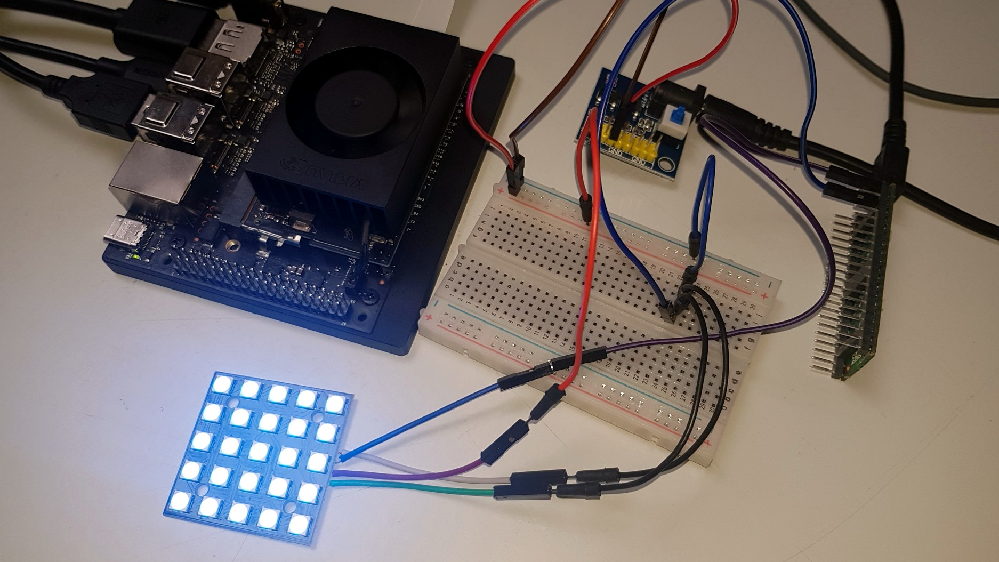
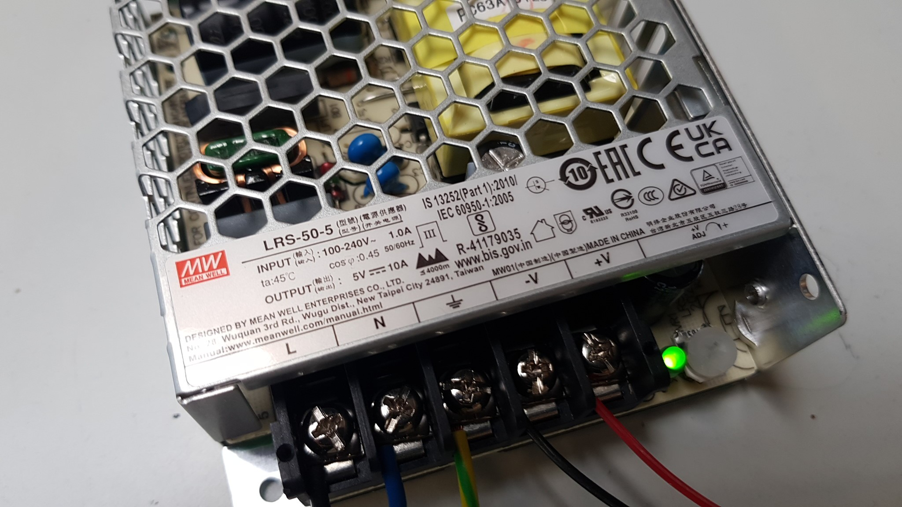

# SediDigi/bg_led/pico_ws2812

WS2812 driver for WS2812 5x5 and 8x8 LED matrix panels, driven by
a Raspberry Pi Pico/Pico 2 (W) and controlled over USB Serial from a
Jetson Orin Nano.

Two on-device implementations are provided:

- **Native C++ (recommended)** — Pico SDK firmware with PIO + DMA for the
  Raspberry Pi Pico 2 W (RP2350). Fully deterministic timing, no dropouts.
- **MicroPython** — PIO-based driver for any Pico (Pico 1 / 2 / 2 W).

Both speak the same USB serial protocol (see `USB Serial Protocol`), so the
host clients in `host/` work unchanged with either.




## Power Supply

In production, the matrix is powered by a **Mean Well LRS-50-5**
(5 V / 10 A / 50 W, ripple ≈80 mV). The Pico is powered over USB from the
Jetson; the panel keeps its own 5 V supply (common ground — see `Wiring`).



## Structure

```
pico_ws2812/
├── device/                     Run on the Pico
│   ├── native/                 Native C++ (Pico SDK) panel server (default) — see "Firmware"
│   ├── panel_server.py         MicroPython USB serial listener (deploy as main.py)
│   ├── demo.py                 WS2812 PIO color cycle demo
│   ├── solid_blue1.py          Solid Blue #1 (003156, dim raw color)
│   └── blink.py                Hello World — onboard LED (GPIO 25)
├── host/                       Run on the Jetson
│   ├── pico_link.py            Python client module + CLI
│   ├── pico_link.hpp           C++ client (header-only)
│   ├── controlpanel.py         GUI color control panel (Tkinter)
│   ├── controlpanel_config.json  User colors + brightness for controlpanel.py
│   ├── demo.py                 Communication demo (10 s per state)
│   ├── blue1_perma.py          Solid blue at 50 % until Enter, then OFF
│   └── blue_dyn.py             Blue spectrum cycle at 50 % until Enter, then OFF
└── README.md
```

`NUM_LEDS` in the device code is configurable (default 25 for the 5×5
panel; set to 64 for the 8×8 panel) — see `Firmware` and `Supported Panel
Sizes`.

## Wiring

```
Jetson USB ──────────────────►  Pico USB (power + serial)
Pico (GPIO 0, Pin 1)  ──────►  WS2812 DIN
Pico GND (Pin 3)      ──┬───►  WS2812 GND
                          │
External 5V Supply         │
  5V+  ──────────────────►  WS2812 VCC
  GND  ──────────────────►  WS2812 GND
```

> **Ground is shared across all three** — Pico GND, Matrix GND, and PSU GND
> must be connected. Without a common ground, the data signal has no
> reference level and the LEDs will not respond.
>
> The matrix has two GND pads. The PSU GND connects to one (power), and
> Pico GND connects to the other (signal). Since both pads are on the same
> ground plane, this satisfies the shared ground requirement.
>
> The Pico is powered by the Jetson via USB; the panel keeps its own 5V
> supply.

## Firmware

The Pico needs exactly one panel-server implementation on it. Use
**Option A (native C++, recommended)**; MicroPython remains a fully
supported alternative.

### Option A: Native C++ (recommended)

`device/native/` is a **Pico SDK firmware** for the **Raspberry Pi Pico
2 W** (RP2350). It drives the WS2812 chain with **PIO + single-frame DMA**:
fully deterministic timing, no garbage-collector/IRQ workarounds, and in
the practical test **no dropouts** — unlike the MicroPython path.

Files:

```
device/native/
├── CMakeLists.txt
├── pico_sdk_import.cmake     (from the Pico SDK)
├── ws2812.pio                PIO program (T1=3, T2=3, T3=4, 8 MHz)
└── main.cpp                  PIO + DMA driver, USB-CDC protocol server
```

Build:

```bash
# one-time prerequisites
sudo apt-get install gcc-arm-none-eabi
git clone --depth 1 --branch 2.3.1 https://github.com/raspberrypi/pico-sdk.git ~/pico-sdk
git -C ~/pico-sdk submodule update --init --depth 1

# build (adjust PICO_SDK_PATH if the SDK lives elsewhere)
PICO_SDK_PATH=~/pico-sdk \
  cmake -S device/native -B device/native/build -DPICO_BOARD=pico2_w
cmake --build device/native/build -j4
```

This produces `device/native/build/pico_ws2812_native.uf2`. Flash it by
holding **BOOTSEL** on the Pico 2 W, plugging in USB, and copying the
`.uf2` onto the mass-storage drive. After a firmware change, rebuild and
re-copy the `.uf2` — the Pico reboots with the new firmware automatically.

`NUM_LEDS` in `main.cpp` is 25 for the 5x5 panel; set it to 64 for the 8x8
panel and rebuild.

### Option B: MicroPython (alternative)

For a plain Pico 1 / 2 (or if you prefer working in Python).

1. The Pico ships without firmware. Download the MicroPython `.uf2` from
   <https://micropython.org/download/rp2-pico/>
2. Hold **BOOTSEL** on the Pico, connect USB to your PC — a mass-storage
   device "RPI-RP2" appears
3. Copy the `.uf2` onto it — the Pico reboots automatically with MicroPython
4. On the Jetson, install Thonny:
   ```bash
   sudo apt install thonny
   ```
   Open Thonny and set **Run → Select interpreter…** →
   **"MicroPython (Raspberry Pi Pico)"**, **Port:** `/dev/ttyACM0`.
5. Open `device/panel_server.py` in Thonny and **File → Save as…** →
   **Raspberry Pi Pico** → save as `main.py`
6. Reset the Pico (or unplug/replug USB) — the server starts automatically
   and waits for commands (standby)

`NUM_LEDS` in `panel_server.py` (and any other deployed script, e.g.
`demo.py`, `solid_blue1.py`) is 25 for the 5x5 panel; set it to 64 for the
8x8 panel, then deploy as `main.py` as usual.

## USB Serial Protocol

The Pico runs one of the implementations from `Firmware` and listens for
line-based commands over USB CDC (`/dev/ttyACM0` on Linux).

### Transport

- Plain ASCII text, one command per line
- Commands end with `\n` (a trailing `\r` is tolerated)
- Responses always end with `\n`
- Exactly one response line per command
- The Pico does not echo input and emits no banners or prompts
- USB CDC ignores the baud rate; the reference clients use 115200

### Commands

| Command | Arguments | Description |
|---------|-----------|-------------|
| `SET` | `RRGGBB [0-100]` | Light all 25 LEDs in the given hex color at the given brightness. Brightness defaults to 50 when omitted. |
| `OFF` | — | Turn the panel off (all LEDs dark). |
| `PING` | — | Liveness check. |
| `VERSION` | — | Report the protocol version. |

### Responses

| Response | Meaning |
|----------|---------|
| `OK` | Command accepted and executed. |
| `ERR <message>` | Command rejected; `<message>` describes the error. |
| `PONG` | Answer to `PING`. |
| `VERSION <n>` | Answer to `VERSION`; current value is `VERSION 1`. |

### Examples

```
SET 0062ac 40     ->  OK
SET 0062ac        ->  OK          (brightness defaults to 50)
SET zzzz 40       ->  ERR invalid color
SET 0062ac 150    ->  ERR brightness must be 0-100
OFF               ->  OK
PING              ->  PONG
VERSION           ->  VERSION 1
```

### Error messages

| Message | Trigger |
|---------|---------|
| `invalid color` | Color is not a 6-digit hex value. |
| `invalid brightness` | Brightness is not an integer. |
| `brightness must be 0-100` | Brightness is outside the valid range. |
| `unknown command` | First token is not a known command. |

### Notes

- `SET` with brightness `0` is equivalent to `OFF`.
- Color values are case-insensitive.
- Unknown trailing tokens are ignored.
- The protocol is language-independent by design; any language that can
  read/write a serial line can implement a client. Reference clients live in
  `host/` (Python `pico_link.py`, C++ `pico_link.hpp`).

### Python (Jetson)

Minimal client:

```python
import serial

ser = serial.Serial("/dev/ttyACM0", 115200, timeout=2)
ser.write(b"SET 0062ac 40\n")
print(ser.readline().decode().strip())   # OK
ser.write(b"OFF\n")
print(ser.readline().decode().strip())   # OK
ser.close()
```

Or the full module (`host/pico_link.py`):

```python
from pico_link import PicoLink

with PicoLink() as link:
    link.set_color("0062ac", 40)   # -> OK
    link.off()                     # -> OK
```

CLI: `python3 pico_link.py SET 0062ac 40`

### C++ (Jetson)

```cpp
#include "pico_link.hpp"

PicoLink p;
std::string r = p.set_color("0062ac", 40);  // "OK"
r = p.ping();                               // "PONG"
p.off();                                    // "OK"
```

## Supported Panel Sizes

The driver is size-agnostic: a WS2812 panel is electrically just a daisy
chain of individually addressable LEDs, and the 5x5 and 8x8 layouts differ
only in how many LEDs are on the wire (25 vs 64).

- **5x5 panel (default):** keep `NUM_LEDS = 25`.
- **8x8 panel:** set `NUM_LEDS = 64` — in `device/native/main.cpp` for
  Option A (rebuild + re-flash), or in `device/panel_server.py` and any
  other deployed script (e.g. `demo.py`, `solid_blue1.py`) for Option B,
  then deploy as `main.py` as usual.

Everything else stays identical: the PIO program, the `SET`/`OFF`/`PING`/
`VERSION` protocol, the host clients, and `blue1_perma.py`/`blue_dyn.py`
all work unchanged for either size.

> **Power (8x8):** 64 WS2812B LEDs draw up to ~60 mA each at full white,
> i.e. **~3.8 A** at 100 % brightness. Use a ≥4 A 5 V supply, or keep the
> brightness at ≤50 % (~1.9 A) — see "Power" in Technical Notes.

## Quickstart

This is shared by both firmware options — the only difference is which
implementation you flashed in `Firmware`.

### 1. USB serial permission

Add your user to the `dialout` group, then log out and back in:

```bash
sudo usermod -a -G dialout $USER
```

### 2. Test the communication (Jetson)

```bash
python3 host/pico_link.py PING
python3 host/pico_link.py SET 0062ac 40
python3 host/demo.py          # PING → blue 40% → blue 25% → red 30% → OFF
```

### 3. Control panel (GUI)

`host/controlpanel.py` is a Tkinter color control panel. Start it from a
desktop session (no `sudo` needed, `dialout` group required):

```bash
python3 host/controlpanel.py
```

It offers the predefined blue palette, custom hex colors, a brightness
slider 0-100 (the protocol brightness in percent), and PING/OFF buttons;
the status line shows the last command's response or error. Choices are
persisted in `host/controlpanel_config.json`. If the Pico is not connected,
the panel stays usable and operations report the error in the status line.

## Known Issues

### MicroPython implementation

- **Last LED in matrix occasionally stayed dark** — caused by `sm.active(0)`
  killing the PIO clock before the OSR finished shifting out the last 24
  bits. **Fixed** by adding `time.sleep_us(50)` after the FIFO drain and
  before `sm.active(0)`. The 50 µs is 1.7× the worst-case OSR drain time
  (30 µs) and has no measurable side effect.
- **Explicit data-pin LOW during reset** (`Pin(0, Pin.OUT, value=0)`)
  caused the Pico to hang — likely a PIO/GPIO ownership conflict. The
  current code relies on `sm.active(0)` alone, leaving the pin in its last
  PIO-driven state. The preceding OSR-drain delay ensures the final bit is
  fully transmitted, so the reset pulse is clean.
- **Occasional dropouts (rare, MicroPython only)** — 1 of 25 LEDs may skip
  a frame under heavy runtime activity (USB IRQ, allocation).
  `gc.disable()` + `disable_irq()` around the critical section reduces this
  to near-zero. **Solved** in Option A (native C++), which showed no
  dropouts in the practical test.

### Hardware / power (both)

- **Visible flickering at full brightness (static image):** Observed with
  `solid_blue1.py` at `(0x00, 0x62, 0xac)`. **Fixed** by halving brightness
  to `(0x00, 0x31, 0x56)` — flickering stopped entirely. Root cause is
  most likely the 5V supply voltage sagging under the ~1.5 A peak draw of
  25 LEDs at full brightness. A beefier PSU (≥3 A) or staying at ≤50%
  brightness resolves the issue.

## Technical Notes

### Common (both)

- **PIO frequency:** 8 MHz (125 ns per cycle)
- **Bit 0 timing:** 3 cycles HIGH (375 ns) + 7 cycles LOW (875 ns)
- **Bit 1 timing:** 6 cycles HIGH (750 ns) + 4 cycles LOW (500 ns)
- **Data order:** GRB (WS2812 spec), MSB first
- **No level shifter needed** — Pico drives the data line at 3.3V directly,
  and unlike the Jetson's GPIO, the PIO timing is tight enough that the
  WS2812 decodes the signal reliably
- **No series resistor on data line** — the Pico → DIN connection is short
  (<15 cm), making signal reflections negligible
- **Power:** Pico powered over USB; the matrix keeps its own 5V supply. The
  PIO driver holds all 25 LEDs statically (no time-slicing), so the 5V draw
  is a constant DC load. Per the WS2812B datasheet each LED draws up to
  ~60 mA at full white (20 mA per R/G/B channel), so a solid WHITE fill at
  100 % peaks at ~1.5 A — matching the peak draw noted in "Known Issues".
  Because `set_panel()` scales every channel linearly, brightness 50 %
  halves this to ~0.75 A. The deployed "Blue tone 1" `003156` (G=0x31, B=0x56)
  draws ~0.40 A / ~2.0 W at 100 %, and `blue1_perma.py` at 50 % (≈ G 0x18,
  B 0x2B) only ~0.20 A / ~1.0 W. Estimate based on the datasheet; the
  panel's limiting resistors are unspecified. For an 8x8 panel (64 LEDs)
  scale accordingly: full WHITE at 100 % peaks at ~3.8 A (≥4 A supply),
  ~1.9 A at 50 %.
- **Heat:** The static drive keeps a constant current, but at the deployed
  blue1 load (~0.2 A across 25 LEDs) thermal load is negligible. The real
  limit is the 5V supply: the ~1.5 A full-brightness peak sags a small
  supply, which is what the flicker at `(0x00, 0x62, 0xac)` showed (gone at
  the ~half-bright `(0x00, 0x31, 0x56)`). Use a ≥3 A supply or stay at
  ≤50 % brightness (see Known Issues). Still verify surface temperature in
  the final mounting with an IR thermometer.

### MicroPython only

- `gc.disable()` and `disable_irq()` around the critical section avoid
  mid-frame drops under allocation/IRQ load.
- `sm.active(0)` alone (no explicit data-pin LOW) leaves the pin in its
  last PIO state; the 50 µs OSR-drain delay guarantees the final bit is out
  before the clock stops.
