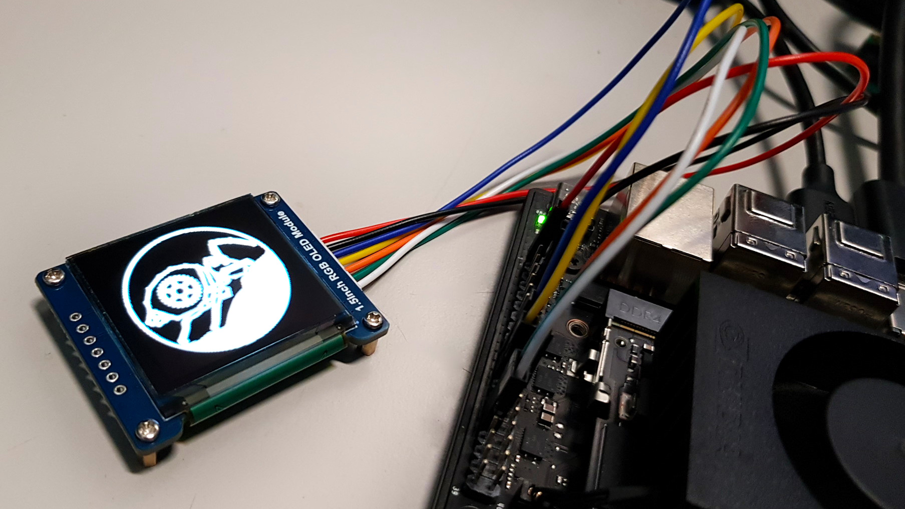
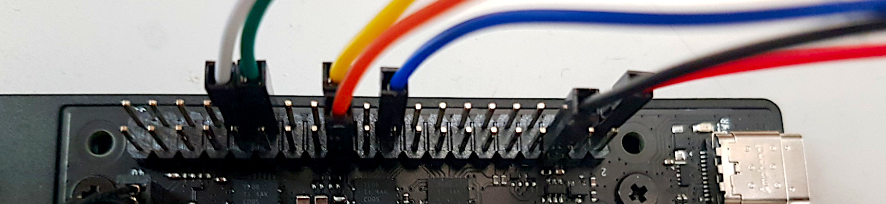

# SediDigi/bg_oled

Driving a Waveshare 1.5inch RGB OLED Display Module (SSD1351, 128×128 px, SPI) via the 40-pin GPIO header of the Jetson Orin Nano.



## Files

- **`config.py`** — GPIO/SPI configuration (Jetson.GPIO + spidev)
- **`OLED_1_5inch_rgb.py`** — SSD1351 display driver with class `OLED_1_5inch_rgb`
- **`demo.py`** — Demo script with 4 phases: clear display / draw image (logo.bmp) / fill screen with one color, given as hexadecimal RGB color code(s) / show color images (bitmaps from folder bgimages/)
- **`controlpanel_oled.py`** — tiny Python app with GUI for controlling the OLED display color
- **`controlpanel_config.json`** — user-defined colors and brightness, used by `controlpanel_oled.py`
- **`logo.bmp`** — Project logo as a bitmap (128×128 px)
- **`bgimages/`** — Directory for background bitmaps (128×128 px)
- **`README.md`** — This file

## Pinout & Wiring

### OLED Module (SSD1351)

| PIN | Description |
|-----|-------------|
| VCC | 3.3 V / 5 V |
| GND | Ground |
| DIN | Data (MOSI) |
| CLK | Clock (SCK) |
| CS | Chip Select (active low) |
| DC | Data/Command (high = data, low = command) |
| RST | Reset (active low) |

The module is factory-configured for **4-Wire SPI** (BS0 = 0), no solder bridge changes required.

### Jetson Orin Nano 40‑Pin Header (J12)

Header scheme

```
 |                      3.3V (  1) .. (  2) 5V                        |
 |                      i2c8 (  3) .. (  4) 5V                        |
 |                      i2c8 (  5) .. (  6) GND                       |
 |                    unused (  7) .. (  8) uarta                     |
 |                       GND (  9) .. ( 10) uarta                     |
 |                    unused ( 11) .. ( 12) unused                    |
 |                    unused ( 13) .. ( 14) GND                       |
 |                    unused ( 15) .. ( 16) unused                    |
 |                      3.3V ( 17) .. ( 18) unused                    |
 |                 spi1_dout ( 19) .. ( 20) GND                       |
 |                  spi1_din ( 21) .. ( 22) unused                    |
 |                  spi1_sck ( 23) .. ( 24) spi1_cs0                  |
 |                       GND ( 25) .. ( 26) spi1_cs1                  |
 |                      i2c2 ( 27) .. ( 28) i2c2                      |
 |                      gpio ( 29) .. ( 30) GND                       |
 |                      gpio ( 31) .. ( 32) unused                    |
 |                    unused ( 33) .. ( 34) GND                       |
 |                    unused ( 35) .. ( 36) unused                    |
 |                    unused ( 37) .. ( 38) unused                    |
 |                       GND ( 39) .. ( 40) unused                    |
```

### Wiring

| OLED | Jetson Orin Nano 40‑Pin | Pin No. |
|------|--------------------------|---------|
| VCC | 3.3 V | 1 |
| GND | GND | 6 |
| DIN | SPI0\_MOSI | 19 |
| CLK | SPI0\_SCK | 23 |
| CS | SPI0\_CS0 | 24 |
| DC | GPIO01 (GPIO453) | 29 |
| RST | GPIO11 (GPIO454) | 31 |




## Software Setup

### Enable SPI and GPIO pins (jetson-io)

```bash
sudo /opt/nvidia/jetson-io/jetson-io.py
```

- Select "Configure Jetson 40pin Header"
- Select "Configure header pins manually", enable SPI1, enable pin 29 and 31 for GPIO.
- Ensure that the shown layout is now identical to the header scheme given above.
- Save, exit and reboot.


### Install Jetson.GPIO and Python dependencies

```bash
sudo apt install python3-pip
sudo pip3 install Jetson.GPIO

sudo apt install python3-pil python3-numpy
sudo pip3 install spidev
```

### Run the demo

Start the demo to make sure that everything is working.

```bash
sudo python3 demo.py
```

Remark: Filling the OLED screen with one color via `FillColor(..)` is slightly faster than showing a unicolor image via `ShowImage(...)`.


### Run the OLED display control app

Start the Python application for controlling the OLED display color (and soon, also the screen brightness).

```bash
sudo python3 controlpanel_oled.py
```

## Roadmap

Planned features and improvements:

- [x] adapt SPI frequency for a suitable speed (display reacts very slowly, needs ca. 10 s for a complete screen change) -> 10 MHz is maximum of SSD1351, display reacts still lazy
- [x] optimised data transfer in 4096-byte chunks -> display now refreshes immediately
- [x] implement and test a OLED display control app
- [x] control the screen brightness via display control app
- [x] test the OLED module for its suitability as a background display -> failed.
- [x] clone this subproject and adapt it for a TFT display module of nearly the same size

## Notes

### Controlling the OLED Display Refresh Rate

The SSD1351 driver IC provides two registers that influence the internal frame rate.
Both are configured in `OLED_1_5inch_rgb.py:Init()`.

**Register `0xB3` — Front Clock Divider / Oscillator Frequency**
- `[7:4]` — oscillator frequency (`0x0`–`0xF`, higher = faster)
- `[3:0]` — DCLK divider: `DCLK = CLK / (divider + 1)`
- Factory default: `0xF1` → max oscillator, divider=1 → DCLK = CLK/2
- Current setting: `0xF0` → divider=0 → DCLK = CLK (no division)

**Register `0xB1` — Phase Length (Pre-Charge + Drive)**
- `[7:4]` — Phase 2 (drive period in DCLK cycles)
- `[3:0]` — Phase 1 (pre-charge period in DCLK cycles)
- Frame duration ≈ `(Phase1 + Phase2) × 128 rows / DCLK`
- Smaller values increase frame rate but may cause display artifacts
- Factory default: `0x32` → Phase1=2, Phase2=3
- Current setting: `0x11` → Phase1=1, Phase2=1

The SPI clock rate (default: 10 MHz) only affects how fast pixel data is transferred to the display's internal frame buffer (GDDRAM), not the rate at which the SSD1351 refreshes the OLED pixels from that buffer.

## References

- [Waveshare Wiki – 1.5inch RGB OLED Module](https://www.waveshare.com/wiki/1.5inch_RGB_OLED_Module)
- [Waveshare SSD1351 Datasheet](https://www.waveshare.com/w/upload/3/3f/SSD1351-Revision_1.5.pdf)
- [Jetson Orin Nano GPIO Pinout](https://jetsonhacks.com/nvidia-jetson-orin-nano-gpio-header-pinout)
- [Jetson.GPIO @ GitHub](https://github.com/NVIDIA/jetson-gpio)
- [GPIO Quickfix for Jetpack 6.2 @ Github](https://github.com/harshadl/jetson-orin-nano-gpio-quickfix)
