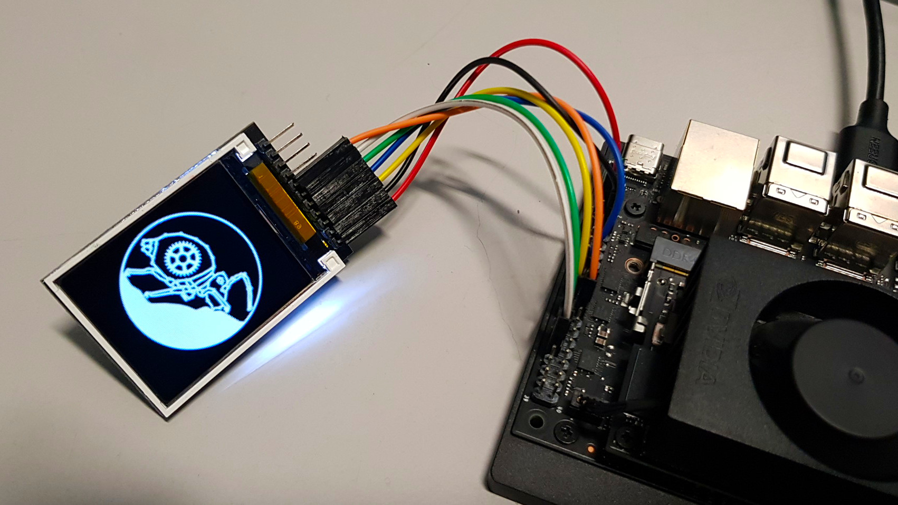

# SediDigi/bg_tft

Driving a Joy-it RB TFT1.8 Display Module (ST7735S, 128x160 px, SPI) via the 40-pin GPIO header of the Jetson Orin Nano. The display features an LED backlight. Unfortunately, its brightness cannot be controlled.



## Files

- **`config.py`** — GPIO/SPI configuration (Jetson.GPIO + spidev)
- **`TFT_1_8inch.py`** — ST7735S display driver with class `TFT_1_8inch`
- **`demo.py`** — Demo script with 4 phases: clear display / draw logo / fill screen with one color, given as hexadecimal RGB color code(s) / show color images (unicolor 128x160, from folder bgimages/)
- **`demo_flicker.py`** — Test script that alternates white/black at ~42 Hz to visualise rolling‑shutter banding
- **`controlpanel_tft.py`** — tiny Python app with GUI for controlling the TFT display color
- **`colors_config.json`** — user-defined colors, used by `controlpanel_tft.py`
- **`logo.bmp`** — Project logo as a bitmap (128x160 px)
- **`bgimages/`** — Directory for background bitmaps (128x160 px, unicolor)
- **`README.md`** — This file

## Pinout & Wiring

### TFT Module (ST7735S) — Joy-it RB TFT1.8

| PIN | Description |
|-----|-------------|
| VCC | 3.3 V |
| GND | Ground |
| SCL | SPI Clock (SCK) |
| SDA | SPI Data (MOSI) |
| DC | Data/Command (high = data, low = command) |
| RES | Reset (active low) |
| CS | Chip Select (active low) |

### Jetson Orin Nano 40-Pin Header (J12)

```
 |                      3.3V (  1) .. (  2) 5V                        |
 |                      i2c8 (  3) .. (  4) 5V                        |
 |                      i2c8 (  5) .. (  6) GND                       |
 |                    unused (  7) .. (  8) uarta                     |
 |                       GND (  9) .. ( 10) uarta                     |
 |                    unused ( 11) .. ( 12) unused                    |
 |                    unused ( 13) .. ( 14) GND                       |
 |                    unused ( 15) .. ( 16) unused                    |
 |                      3.3V ( 17) .. ( 18) unused                    |
 |                 spi1_dout ( 19) .. ( 20) GND                       |
 |                  spi1_din ( 21) .. ( 22) unused                    |
 |                  spi1_sck ( 23) .. ( 24) spi1_cs0                  |
 |                       GND ( 25) .. ( 26) spi1_cs1                  |
 |                      i2c2 ( 27) .. ( 28) i2c2                      |
 |                      gpio ( 29) .. ( 30) GND                       |
 |                      gpio ( 31) .. ( 32) unused                    |
 |                    unused ( 33) .. ( 34) GND                       |
 |                    unused ( 35) .. ( 36) unused                    |
 |                    unused ( 37) .. ( 38) unused                    |
 |                       GND ( 39) .. ( 40) unused                    |
```

### Wiring

| TFT | Jetson Orin Nano 40-Pin | Pin No. |
|-----|--------------------------|---------|
| VCC | 3.3 V | 1 |
| GND | GND | 6 |
| SCL | SPI0_SCK | 23 |
| SDA | SPI0_MOSI | 19 |
| DC | GPIO01 (GPIO453) | 29 |
| RES | GPIO11 (GPIO454) | 31 |
| CS | SPI0_CS0 | 24 |

## Software Setup

### Enable SPI and GPIO pins (jetson-io)

```bash
sudo /opt/nvidia/jetson-io/jetson-io.py
```

- Select "Configure Jetson 40pin Header"
- Select "Configure header pins manually", enable SPI1, enable pins 29 and 31 for GPIO
- Ensure that the layout is identical to the header scheme given above
- Save, exit and reboot

### Install Jetson.GPIO and Python dependencies

```bash
sudo apt install python3-pip
sudo pip3 install Jetson.GPIO

sudo apt install python3-pil python3-numpy
sudo pip3 install spidev
```

### Run the demo

Start the demo to make sure that everything is working.

```bash
sudo python3 demo.py
```

### Run the TFT display control app

Start the Python application for controlling the TFT display color.

```bash
sudo python3 controlpanel_tft.py
```

## Roadmap

Planned features and improvements:

- [x] optimise SPI frequency: 8 MHz
- [x] optimise LCD frequency according to the camera framerate: ~ 84 Hz
- [ ] test the TFT module for its suitability as a background display

## Notes

### LCD FRMCTR1 Optimisation

The ST7735S frame rate in normal mode is determined by register FRMCTR1 (0xB1):

```
f_FR = f_OSC / ((RTNA × 2 + 40) × (LINE + FPA + BPA + 2))
```

- `f_OSC` — internal oscillator frequency (850 kHz)
- `RTNA` — 1-line period (4 bit, range 0–15)
- `FPA`, `BPA` — front / back porch (6 bit each, range 1–63)
- `LINE` — display height (160 for 128×160 resolution)

To minimise rolling‑shutter flicker, the LCD refresh rate should be an integer multiple of the camera frame rate. Below are precalculated optimal FRMCTR1 values for common camera configurations:

| Register | 21 fps → 84 Hz (×4) | 20 fps → 100 Hz (×5) | 30 fps → 90 Hz (×3) | 60 fps → 120 Hz (×2) |
|----------|---------------------|----------------------|---------------------|----------------------|
| RTNA     | 0x31 (RTNA=3)       | 0x51 (RTNA=5)        | 0x01 (RTNA=0)       | 0x01 (RTNA=0)        |
| FPA      | 0x1D (FPA=29)       | 0x01 (FPA=1)         | 0x0B (FPA=11)       | 0x01 (FPA=1)         |
| BPA      | 0x1D (BPA=29)       | 0x07 (BPA=7)         | 0x3F (BPA=63)       | 0x0E (BPA=14)        |
| Achieved | 83.99 Hz (0.01 %)   | 100.00 Hz (0.00 %)  | 90.04 Hz (0.05 %)   | 120.06 Hz (0.05 %)  |

Configuration is done in `TFT_1_8inch.py`.
Use this oneliner for a quick live test with Arducam IMX 477 (aelock=true disables auto gain to prevent noise amplification):

```bash
gst-launch-1.0 nvarguscamerasrc sensor_id=0 aelock=true ! "video/x-raw(memory:NVMM),width=4032,height=3040,framerate=21/1" ! nvvidconv ! nvegltransform ! nveglglessink -e
```

## References

- [Joy-it RB-TFT1.8 Wiki – product page](https://joy-it.net/en/products/RB-TFT1.8)
- [Joy-it RB-TFT1.8 Manual (PDF)](https://joy-it.net/files/files/Produkte/RB-TFT1.8/RB-TFT1.8_Manual_2023-01-06.pdf)
- [ST7735S Datasheet](https://www.displayfuture.com/Display/datasheet/controller/ST7735S.pdf)
- [Adafruit ST7735 Library – reference implementation in C++](https://github.com/adafruit/Adafruit-ST7735-Library)
- [Jetson Orin Nano GPIO Pinout](https://jetsonhacks.com/nvidia-jetson-orin-nano-gpio-header-pinout)
- [Jetson.GPIO @ GitHub](https://github.com/NVIDIA/jetson-gpio)
- [GPIO Quickfix for Jetpack 6.2 @ GitHub](https://github.com/harshadl/jetson-orin-nano-gpio-quickfix)
