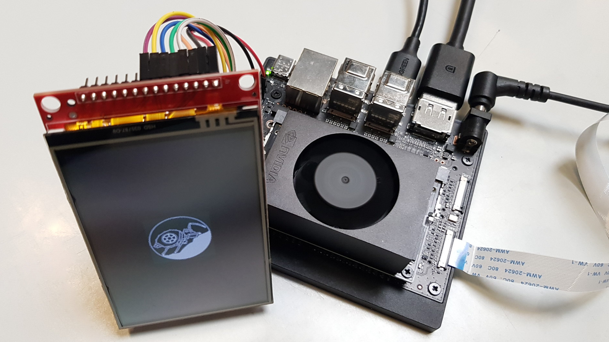
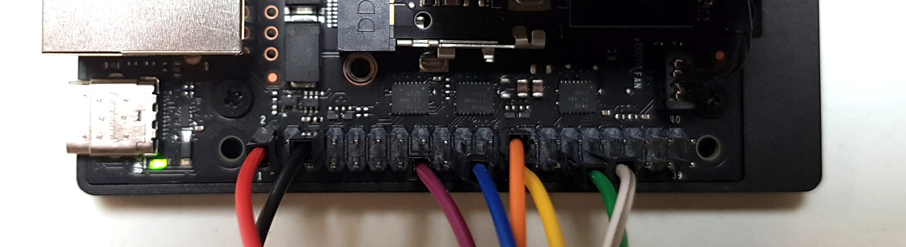
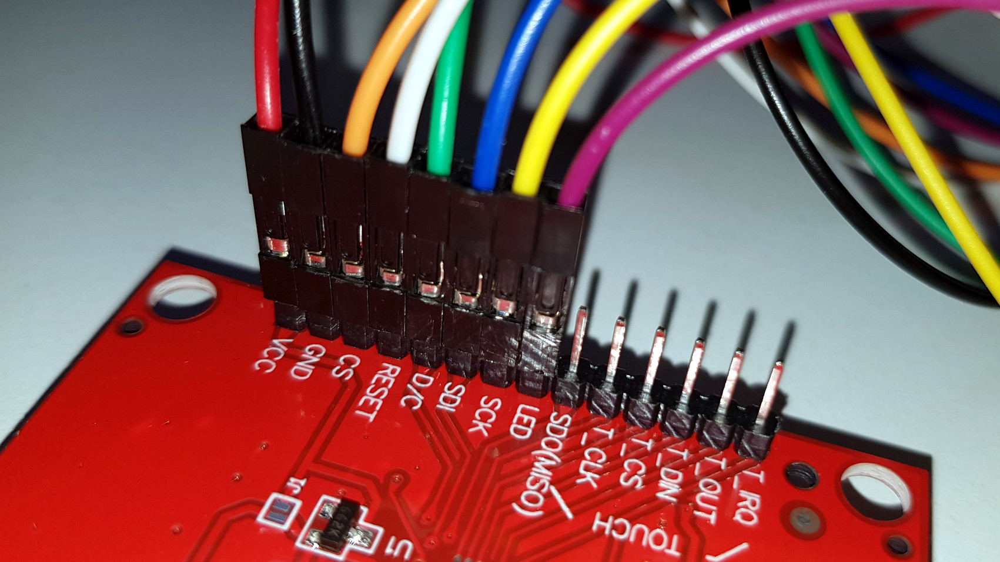
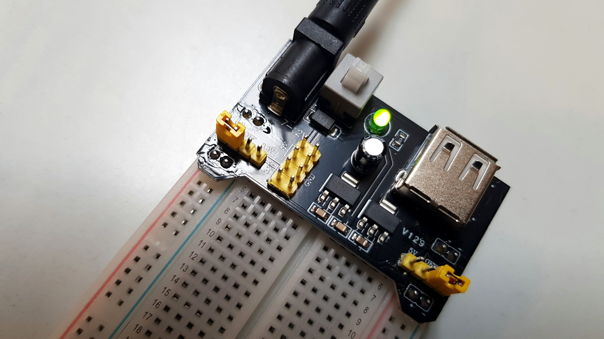

# SediDigi/bg_tft_lit

Driving a KMRTM35018-SPI 3.5" TFT Display Module (Controller ILI9488, 320×480 px, SPI)
via the 40-pin GPIO header of the Jetson Orin Nano.
The display features a PWM-controlled LED backlight with adjustable brightness.
The offered touch function of this module is not used.



## Files

- **`config.py`** — SPI config (20 MHz) + PWM backlight via sysfs (pwmchip0, 10 kHz)
- **`TFT_3_5inch.py`** — ILI9488 display driver with class `TFT_3_5inch`
- **`demo.py`** — Demo script: clear → logo → fill 7 colors → show 7 bgimages
- **`controlpanel_tft_lit.py`** — Tkinter GUI for selecting color and brightness
- **`colors_config.json`** — User-defined colors and brightness level
- **`logo.bmp`** — Project logo (320×480 px, centered on black)
- **`bgimages/`** — 7 background bitmaps (320×480 px, unicolor)
- **`README.md`** — This file

## Pinout & Wiring

### TFT Module (ILI9488) — KMRTM35018-SPI

| PIN | Description |
|-----|-------------|
| VCC | 5 V |
| GND | Ground |
| CS | Chip Select (active low) |
| RESET | Reset (active low) |
| DC | Data/Command (high = data, low = command) |
| SDI/MOSI | SPI Data (MOSI) |
| SCK | SPI Clock |
| LED | Backlight (PWM dimmable) |

### Jetson Orin Nano 40-Pin Header (J12)

```
 |                      3.3V (  1) .. (  2) 5V                        |
 |                      i2c8 (  3) .. (  4) 5V                        |
 |                      i2c8 (  5) .. (  6) GND                       |
 |                    unused (  7) .. (  8) uarta                     |
 |                       GND (  9) .. ( 10) uarta                     |
 |                    unused ( 11) .. ( 12) unused                    |
 |                    unused ( 13) .. ( 14) GND                       |
 |                    pwm2  ( 15) .. ( 16) unused                    |
 |                      3.3V ( 17) .. ( 18) unused                    |
 |                 spi1_dout ( 19) .. ( 20) GND                       |
 |                  spi1_din ( 21) .. ( 22) unused                    |
 |                  spi1_sck ( 23) .. ( 24) spi1_cs0                  |
 |                       GND ( 25) .. ( 26) spi1_cs1                  |
 |                      i2c2 ( 27) .. ( 28) i2c2                      |
 |                      gpio ( 29) .. ( 30) GND                       |
 |                      gpio ( 31) .. ( 32) unused                    |
 |                    unused ( 33) .. ( 34) GND                       |
 |                    unused ( 35) .. ( 36) unused                    |
 |                    unused ( 37) .. ( 38) unused                    |
 |                       GND ( 39) .. ( 40) unused                    |
```

### Wiring

| TFT | Jetson Orin Nano 40-Pin | Pin No. |
|-----|--------------------------|---------|
| VCC | 5 V | 2 |
| GND | GND | 14 |
| SCL | SPI0_SCK | 23 |
| SDA | SPI0_MOSI | 19 |
| DC | GPIO01 (GPIO453) | 29 |
| RES | GPIO11 (GPIO454) | 31 |
| CS | SPI0_CS0 | 24 |
| LED | PWM2 (sysfs pwmchip0) | 15 |






## Software Setup

### Enable SPI, GPIO pins, and PWM (jetson-io)

```bash
sudo /opt/nvidia/jetson-io/jetson-io.py
```

- Select "Configure Jetson 40pin Header"
- Select "Configure header pins manually", enable SPI1, enable pins 29 and 31 for GPIO, enable pin 15 for PWM2
- Ensure that the layout is identical to the header scheme given above
- Save, exit and reboot

### Install Jetson.GPIO and Python dependencies

```bash
sudo apt install python3-pip
sudo pip3 install Jetson.GPIO

sudo apt install python3-pil python3-numpy
sudo pip3 install spidev
```

### Run the demo

```bash
python3 demo.py
```

### Run the TFT display control app

```bash
python3 controlpanel_tft_lit.py
```

## Backlight Control

The backlight is controlled via hardware PWM (sysfs interface at `/sys/class/pwm/pwmchip0/`) on header pin 15 (PWM2 function).  
PWM frequency: 10 kHz (period 100 µs).  
Brightness range: 0–100 %. 

The GUI slider of TFT display control app updates this value live.  
The brightness level is persisted in `colors_config.json`.

## Troubleshooting

### Flickering display

If the backlight flickers regardless of the current brightness setting, the 3.3 V rail on the Jetson may have ripple.
Supply the display VCC from the 5 V pin (pin 2) instead of 3.3 V (pin 1). The module's onboard regulator can handle 5 V input.

Using a separate power supply, such as the MB102, is recommended.




### No image shown / display stays dark

The ILI9488 in SPI mode requires 18-bit RGB666 pixel format.
- `config.py`: pixel format register `0x3A` must be set to `0x66`
- Buffer: 3 bytes per pixel (R/G/B left-aligned 6 bit)
- MADCTL = `0x08` (BGR, portrait)

### 16-bit RGB (RGB565) is not working

The manufacturer (and the ILI9488 datasheet) list RGB565 (register `0x3A = 0x55`) as a valid pixel format for 4-line SPI.
In practice, this format produces wrong or corrupted colours on the ILI9488 over SPI. The controller only renders correctly in RGB666 (18-bit) mode (`0x3A = 0x66`, 3 bytes per pixel).

This is a known discrepancy, confirmed across multiple open-source driver projects. So please do not change register `0x3A` to `0x55`, the display will not show correct colours, despite the datasheet claiming otherwise.

### Mixed‑colour flicker (banding)

When the display shows mixed colours (any channel at an intermediate value, not 0 or 255), a rolling‑shutter camera may pick up faint horizontal banding. Solid primary colours (R/G/B at 100 %) are unaffected.

The cause is a combination of the internal LC response time at partial gray levels and the sub‑frame timing of the ILI9488, which cannot be fully eliminated by register tuning. The effect is reduced by matching the panel refresh rate to an integer multiple of the camera frame rate (FRMCTR1 preset `0x98` for 21 fps × 3 ≈ 64 Hz) and by raising the backlight PWM to 20 kHz.

### PWM is not working

- Verify that pin 15 is configured as PWM2 via `jetson-io`
- Confirm that pwmchip0 exists: `ls /sys/class/pwm/pwmchip0/`
- Export channel 0 and set duty_cycle / period if needed
- Root rights may not be required if udev rules are in place

## Notes

### LCD FRMCTR1 Optimisation

The ILI9488 frame rate in normal mode is controlled by register FRMCTR1 (0xB1):

```
f_FR ∝ 1 / (pow(2, DIVA) × RTNA)
```

- `DIVA` — clock division ratio (2 bit, 0 = f_OSC/1, 1 = f_OSC/2, 2 = f_OSC/4, 3 = f_OSC/8)
- `RTNA` — line period (5 bit, range 16–31)
- Reference value: `0xA0` (DIVA=0, RTNA=20) → 60.76 Hz

To minimise rolling‑shutter flicker, the LCD refresh rate should be an integer multiple of the camera frame rate. Selectable presets:

| Register | 60 fps → 60 Hz (×1) | 30 fps → 60 Hz (×2) | 21 fps → 63 Hz (×3) |
|----------|---------------------|---------------------|---------------------|
| Value    | `0xA0`              | `0xA0`              | `0x98`              |
| DIVA     | 0 (f_OSC/1)         | 0 (f_OSC/1)         | 0 (f_OSC/1)         |
| RTNA     | 20                  | 20                  | 19                  |
| Achieved | 60.76 Hz            | 60.76 Hz            | 63.96 Hz            |

Configuration is done in `TFT_3_5inch.py` via `_FRMCTR1_INDEX`.

Use this oneliner for a quick live test with Arducam IMX 477 (aelock=true disables auto gain to prevent noise amplification):

```bash
gst-launch-1.0 nvarguscamerasrc sensor_id=0 aelock=true ! "video/x-raw(memory:NVMM),width=4032,height=3040,framerate=21/1" ! nvvidconv ! nvegltransform ! nveglglessink -e
```

## Roadmap

- [x] adapt driver from ST7735S (128×160) to ILI9488 (320×480)
- [x] adapt SPI frequency: 20 MHz
- [x] PWM backlight control with adjustable brightness
- [x] fix flicker: supply VCC from 5 V (pin 2) instead of 3.3 V
- [x] flicker test with ArduCam IMX477
- [x] separate power supply for suppressing display glitches
- [x] test the TFT module for its suitability as a background display -> failed
- [ ] optional:  combine TFT with diffusion foil

## References

- [KMRTM35018-SPI product info (Cirkit Designer)](https://docs.cirkitdesigner.com/component/702669c6-ac3c-4820-9244-be08833735ba/tft-lcd-35-320x480-ili94888-kmrtm35018)
- [ILI9488 Datasheet](https://www.displayfuture.com/Display/datasheet/controller/ILI9488.pdf)
- [Jetson Orin Nano GPIO Pinout](https://jetsonhacks.com/nvidia-jetson-orin-nano-gpio-header-pinout)
- [Jetson.GPIO @ GitHub](https://github.com/NVIDIA/jetson-gpio)
- [TFT_eSPI Library (Bodmer)](https://github.com/Bodmer/TFT_eSPI)
- [ILI9486 Elixir Driver – Register-Definition DIVA/RTNA](https://ili9486-elixir.hexdocs.pm/ILI9486.html)
