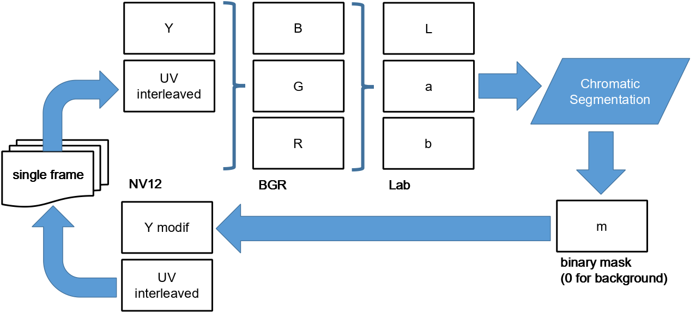

# chrseg_live v0.2.1

Chromatic segmentation live preview with video-file input and full Lab (L+a+b) thresholding.

## What's new in v0.2.1

- **L channel now included in median + thresholding**: the background model and
  the threshold condition test all three Lab channels (`kernel_threshold_lab`):
  `L ∈ [l_lo, l_hi] AND a ∈ [a_lo, a_hi] AND b ∈ [b_lo, b_hi]`
- Objects that differ from the background only in brightness are now detected
  (previously they were masked as background)
- `--delta` applies equally to L, a, b

## What's new in v0.2.0

- **`--input <video-file>`**: read from a video file instead of the camera
- **Native resolution processing**: GPU buffers are allocated to the file's actual resolution (no fixed 4032×3040)
- **`decodebin`** auto-selects demuxer + decoder (MJPEG-AVI, H.264 MKV/MP4, ...)
- Camera flags are ignored (with a warning) in file mode
- File end → EOS → program exits

## Source modes

| Mode | Trigger | Source pipeline |
|------|---------|-----------------|
| Camera | default | `nvarguscamerasrc ... ! nvvidconv ! video/x-raw,format=NV12 ! identity(name=proc)` |
| File | `--input <file>` | `filesrc ! decodebin ! nvvidconv bl-output=false ! video/x-raw,format=NV12 ! identity(name=proc)` |

Everything downstream of `identity` (GPU Lab segmentation, threshold, morphology, masking, tee display/record branches) is identical in both modes.

## Architecture

**GPU pipeline (per frame, resolution = source resolution):**

```
upload NV12
  → [NPP] NV12→BGR
  → [CUDA] BGR→Lab
  → [CPU] median L/a/b (first frame)
  → [CUDA] threshold_lab (L AND a AND b) → not_mask
  → [CUDA] erode → dilate (opening)
  → [CUDA] apply_mask to Y
  → download modified Y (UV untouched)
```



## CLI flags

| Option | Default | Description |
|--------|---------|-------------|
| `--input <file>` | camera | Read from video file instead of camera |
| `--record [file]` | off | Enable recording (re-encode to MJPEG-AVI) |
| `--no-mask` | off | Skip Y channel masking (original image) |
| `--no-morph` | off | Disable morphological opening |
| `--sensor-id <n>` | 0 | Camera sensor ID (ignored in file mode) |
| `--framerate <n/d>` | 21/1 | Camera framerate (ignored in file mode) |
| `--tnr-mode <0\|1\|2>` | 1 | TNR (ignored in file mode) |
| `--tnr-strength <f>` | 0.1 | TNR strength (ignored in file mode) |
| `--ee-mode <0\|1\|2>` | 0 | Edge enhancement (ignored in file mode) |
| `--exposuretime <ns>` | 2500000 | Exposure (ignored in file mode) |
| `--width <n>` | 1280 | Display width (4:3) |
| `--delta <n>` | 10 | Threshold % (0–100), applies to L, a, b |
| `--benchmark` | off | 30-frame timing stats |
| `--debug` | off | GStreamer debug |

In file mode, explicitly-passed camera flags produce `WARNING: --xxx ignored in file mode` but execution continues.

## Build

```bash
cmake -S identities -B identities/build && cmake --build identities/build --target chrseg_live_v0_2_1
```

## Usage

```bash
# Camera (unchanged behaviour)
chrseg_live_v0_2_1

# Play a recorded video (from chrseg_live --record)
chrseg_live_v0_2_1 --input <video filename>

# File with masking disabled
chrseg_live_v0_2_1 --input <video filename> --no-mask

# Re-encode file to a new recording
chrseg_live_v0_2_1 --input <video filename> --record <record filename>

# Benchmark GPU processing from file
chrseg_live_v0_2_1 --input <video filename> --benchmark
```

Press ENTER or close the window to stop. In file mode the program also exits automatically at end of file.

## Notes

### Dynamic resolution & GPU memory

GPU buffers (`d_y`, `d_uv`, `d_bgr`, `d_lab`, `d_mask`, `d_tmp`) are sized to the buffer resolution via `gpu_prepare(ctx, w, h)` in the handoff callback. If the resolution changes (e.g. different file), buffers are freed and reallocated. Example memory for common resolutions:

| Resolution | Y | UV | BGR | Lab | Mask | Tmp | Total |
|------------|-------|-------|-------|-------|-------|-------|-------|
| 4032×3040 | 12 MB | 6 MB | 37 MB | 37 MB | 12 MB | 12 MB | ~116 MB |
| 1920×1080 | 2 MB | 1 MB | 6 MB | 6 MB | 2 MB | 2 MB | ~19 MB |

### Display size in file mode

`--width` still controls the display size (default 1280×960). Larger/smaller files are scaled to fit via the display branch `nvvidconv`. Processing is always at native resolution.

### Morphological mask size

The structuring element is hardcoded as **3×3** in the CUDA kernels:

| Kernel | File:Line | Loop bounds |
|--------|-----------|-------------|
| `kernel_erode3x3` | `seg_kernels.cuh:113` | `dy = [-1, 1]`, `dx = [-1, 1]` |
| `kernel_dilate3x3` | `seg_kernels.cuh:133` | `dy = [-1, 1]`, `dx = [-1, 1]` |

To change to a larger mask (e.g. 5×5), adjust the loop bounds in both kernels:

```c
for (int dy = -2; dy <= 2; dy++)   // was -1..1
    for (int dx = -2; dx <= 2; dx++)
```

The launch helpers `launch_erode3x3` and `launch_dilate3x3` need no changes — they only configure the grid size.

### Recording from file

`nvjpegenc` re-encodes processed frames to MJPEG-AVI. If the file's native framerate exceeds nvjpegenc throughput, the `leaky=downstream` queue drops frames rather than blocking the pipeline.

### Why nvvidconv (not videoconvert) after decodebin

On this platform `decodebin` auto-selects the hardware decoder `nvjpegdec` for MJPEG-AVI, which outputs **NVMM** I420 buffers. The standard `videoconvert` element cannot map NVMM memory → **`not-negotiated`** error from the demuxer. `nvvidconv bl-output=false` handles NVMM input and produces system-memory NV12, matching the identity handoff requirements (same element/caps as the camera path).

### L channel in thresholding (v0.2.1)

The median and the threshold condition now include the lightness channel L
(scaled 0–255, `L8 = L·2.55`), so a background pixel must match the median in
**L AND a AND b**:

```
L ∈ [median_L ± 255·delta/100] AND a ∈ [median_a ± …] AND b ∈ [median_b ± …]
```

Rationale: the camera runs fixed exposure (`exposuretime` 2.5 ms, AELock), so L
is stable within a session. Objects that share the background hue (a/b) but
differ in brightness are now separated instead of being masked as background.
Caveats:

- At `--delta 10`, the L window is `median_L ± 25` (L8) ≈ ±10 L* units — a
  fairly tight band. If the scene illumination changes or the background is
  non-uniformly lit, raise `--delta` or watch for "flashing" mask borders.
- Highlights/shadows on the background can leave the L window → show as
  foreground objects. `--no-mask` gives the unmodified image for comparison.

### File-mode preroll (fix for typefind error)

File mode first transitions the pipeline to **PAUSED** and waits for preroll
before going to PLAYING. Reason: `decodebin`'s typefind runs in **pull mode**
against `filesrc`; jumping straight to PLAYING can race the pull contract and
abort with `typefind: Internal data stream error` / `Found caps (NULL)` even
though the same chain plays fine via gst-launch (which always prerolls).
Camera mode is unchanged (direct PLAYING, live source).

### Encoding formats for --input

Tested focus: MJPEG-AVI produced by `chrseg_live --record` (avidemux + nvjpegdec via decodebin). decodebin also handles H.264 MKV (from capture2_x264) and other formats.

## Files

- `chrseg_live_v0_2_1.cu` — main source
- `seg_kernels.cuh` — header-only CUDA kernels
- `CMakeLists.txt` — build config

## Changes from v0.2.0

- L channel included in first-frame median (`median_l`) and in thresholding
- New `kernel_threshold_lab` + `launch_threshold_lab` in `seg_kernels.cuh`
  (old `kernel_threshold_ab` kept for earlier versions)
- Log line: `Median Lab L=… a=… b=…  (delta=…)`
- `--delta` now also gates the L window
- File mode: PAUSED preroll before PLAYING (fixes `typefind: Internal data stream error`)