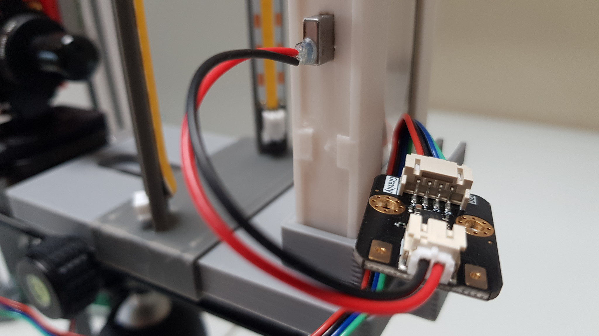
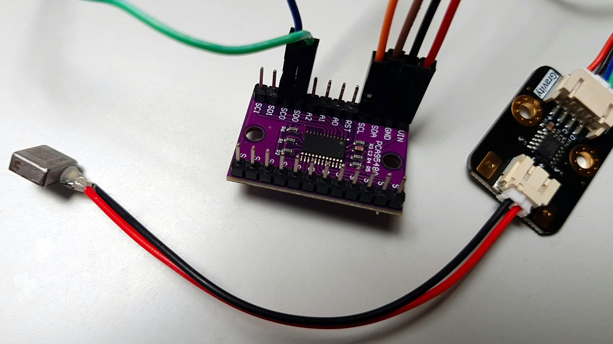
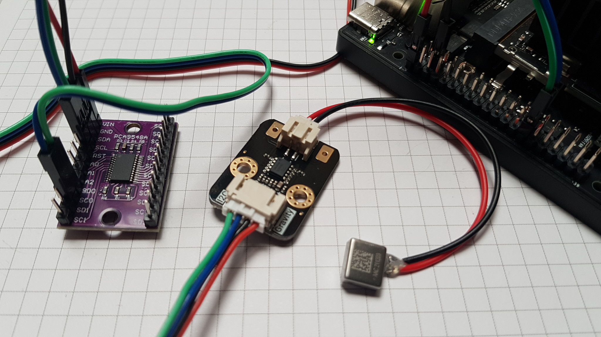
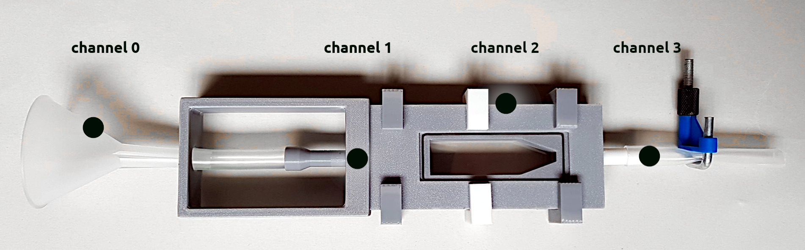

# SediDigi/haptic

Driving haptic motor driver type TM6605 for LRA motors via I2C interface of the 40-pin GPIO header of the Jetson Orin Nano.



Using multiple TM6605 with identical I2C addresses requires the inclusion of an I2C multiplexer like the PCA9548A.



In addition to this, a separate power supply of up to 5 V (cannot be provided via the Jetson Orin Nano's 40-pin header). In production, the LRA motors are powered by a Mean Well LRS-50-5 (5 V / 10 A / 50 W; see also `Power Comsumption`).


## Files

- `DFRobot_TM6605.py` - Low-level driver for TM6605 (developed by fary99, see references; now modified and functionally expanded)
- `PCA9548A.py` - Driver for PCA9548A/TCA9548A I2C multiplexer
- `hapticd.py` - Haptic Feedback Daemon with PCA9548A multiplexer support
- `haptic_cli.py` - CLI Client for the hapticd Daemon (source; installed as `haptic-cli`)
- `haptic_test.py` - Test script for TM6605 modules via PCA9548A multiplexer
- `snippet_single_effect.py` - Minimal snippet to trigger a single effect via the hapticd Daemon
- `snippet_effect_sequence.py` - Minimal snippet to trigger a sequence of effects (e.g. `short_long`) via the hapticd Daemon
- `snippet_single_effect.cpp` - Minimal C++ code example for a single effect via the `haptic-cli` command
- `snippet_effect_sequence.cpp` - Minimal C++ code example for a sequence of effects via the `haptic-cli` command
- `install_hapticd.sh` - Installer script for the hapticd Daemon as a system service
- `uninstall_hapticd.sh` - Uninstaller script for the hapticd system service
- `hapticd.service` - systemd unit file for the hapticd Daemon
- `README.md` - this README file

## Pinout & Wiring

### Jetson Orin Nano 40-Pin Header (J12)

```
 |                      3.3V (  1) .. (  2) 5V                        |
 |                      i2c8 (  3) .. (  4) 5V                        |
 |                      i2c8 (  5) .. (  6) GND                       |
 |                    unused (  7) .. (  8) uarta                     |
 |                       GND (  9) .. ( 10) uarta                     |
 |                    unused ( 11) .. ( 12) unused                    |
 |                    unused ( 13) .. ( 14) GND                       |
 |                      pwm1 ( 15) .. ( 16) unused                    |
 |                      3.3V ( 17) .. ( 18) unused                    |
 |                 spi1_dout ( 19) .. ( 20) GND                       |
 |                  spi1_din ( 21) .. ( 22) unused                    |
 |                  spi1_sck ( 23) .. ( 24) spi1_cs0                  |
 |                       GND ( 25) .. ( 26) spi1_cs1                  |
 |                      i2c2 ( 27) .. ( 28) i2c2                      |
 |                      gpio ( 29) .. ( 30) GND                       |
 |                      gpio ( 31) .. ( 32) unused                    |
 |                    unused ( 33) .. ( 34) GND                       |
 |                    unused ( 35) .. ( 36) unused                    |
 |                    unused ( 37) .. ( 38) unused                    |
 |                       GND ( 39) .. ( 40) unused                    |

```

### Wiring Jetson Orin Nano, PCA9548A and TM6605

```
VCC   -> Jetson Pin 1 (3.3V)
GND   -> Jetson Pin 6 (GND)
SDA   -> Jetson Pin 27 (I2C2_SDA)
SCL   -> Jetson Pin 28 (I2C2_SCL)
RESET -> 3.3V (pull-up)

A0 -> GND
A1 -> GND
A2 -> GND  (address 0x70)

MUX channels (SDx = SDA, SCx = SCL):
SD0/SC0  channel 0
SD1/SC1  channel 1
SD2/SC2  channel 2
SD3/SC3  channel 3
```



## Notes

### Power consumption

The TM6605 driver chip itself consumes very little power: the datasheet
specifies a sleep-mode current of only 9.5 µA (typical, VDD = 5 V). During
vibration the current is determined by the LRA motor, not by the driver. With a
typical 25 Ω LRA at 2.2 VRMS (100 % duty) each module draws roughly 90 mA RMS
(~190 mW) while an effect is playing. Effects are short pulses (see effect
durations in the datasheet), so the average consumption is much lower.

When several modules vibrate at the same time (e.g. `--channel all`), the
supply must handle the sum of the motor currents: up to 4 × ~90 mA ≈ 360 mA
plus margin. The currently used external power supply provides a maximum
output current of 500 mA, which covers this case. 
The Jetson 3.3 V header cannot provide this current,
which is why the modules use a separate 5 V supply.

The driver operates from 2.7-5.2 V and supports load resistances down to 8 Ω;
a motor coil resistance of at least 12 Ω is recommended in the datasheet.

## Software Setup

### Enable I2C pins (jetson-io)

```bash
sudo /opt/nvidia/jetson-io/jetson-io.py
```

- Select "Configure Jetson 40pin Header"
- Select "Configure header pins manually", enable Pin 27 and 28 for I2C2
- Ensure that the layout is identical to the header scheme given above
- Save, exit and reboot

### Install Jetson.GPIO and Python dependencies

```bash
sudo apt install python3-pip
sudo pip3 install Jetson.GPIO
sudo apt install -y python3-smbus
```

### Install the system service (daemon) hapticd

Alternatively, run the installer script from the project directory. It prompts
for the sudo password and reports the progress:

```bash
./install_hapticd.sh
```

The manual steps are:

```bash
sudo mkdir -p /opt/hapticd
sudo cp DFRobot_TM6605.py PCA9548A.py hapticd.py /opt/hapticd/
sudo chmod 755 /opt/hapticd/hapticd.py
sudo chown -R root:root /opt/hapticd

sudo cp haptic_cli.py /usr/local/bin/haptic-cli
sudo chmod 755 /usr/local/bin/haptic-cli

sudo cp hapticd.service /etc/systemd/system/
sudo chmod 644 /etc/systemd/system/hapticd.service

sudo systemctl daemon-reload
sudo systemctl enable hapticd
sudo systemctl start hapticd
```

To uninstall, run `./uninstall_hapticd.sh` (it will ask for confirmation).

### Test the installation

```bash
# status of system service
sudo systemctl status hapticd

# start the demo (run from the project directory)
sudo python3 haptic_test.py

# test the access via command line (installed as haptic-cli)
haptic-cli --list
haptic-cli --channel 0 --effect double_click
haptic-cli --channel 0+2 --effect 47
haptic-cli --channel all --effect 47

# test the socket
echo "0 alert" | sudo socat - UNIX-CONNECT:/run/hapticd.sock
```

If the CLI is not installed, run `python3 haptic_cli.py` from the project
directory instead of `haptic-cli`.

## Assembly

Attach the four modules at the outside of the cuvette according to the diagram below.



## Roadmap

Planned features and improvements:

- [x] `PCA9548A.py` – multiplexer driver
- [x] `haptic_test.py` – test with multiplexer (tested successfully)
- [x] `hapticd.py` – daemon migrated to multiplexer
- [x] `haptic_cli.py` / `haptic-cli` – CLI migrated to multiplexer (--channel instead of --bus)
- [x] `snippet_single_effect.py` / `snippet_effect_sequence.py` – minimal snippets for single effects and effect sequences
- [x] preferred effect combination: 1x short / 1x long (No. 1 + 70)
- [x] asynchronous control, final test with up to four TM6605 modules
- [x] synchronous control, final test with up to four TM6605 modules

## Troubleshooting

### No devices found on an I2C bus

Tegra I2C controllers do not support SMBus Quick Write commands
used by `i2cdetect -y`. The scan therefore skips many addresses.

Use read byte mode instead:

```
i2cdetect -y -r 1
```

This probes each address by reading a single byte, which works
reliably on all Tegra I2C buses. It should give a scheme similar to this one ("70" marks the address of the I2C multiplexer PCA9548A):
```
     0  1  2  3  4  5  6  7  8  9  a  b  c  d  e  f
00:                         -- -- -- -- -- -- -- -- 
10: -- -- -- -- -- -- -- -- -- -- -- -- -- -- -- -- 
20: -- -- -- -- -- UU -- -- -- -- -- -- -- -- -- -- 
30: -- -- -- -- -- -- -- -- -- -- -- -- -- -- -- -- 
40: UU -- -- -- -- -- -- -- -- -- -- -- -- -- -- -- 
50: -- -- -- -- -- -- -- -- -- -- -- -- -- -- -- -- 
60: -- -- -- -- -- -- -- -- -- -- -- -- -- -- -- -- 
70: 70 -- -- -- -- -- -- --  
```

To test a specific device at a known address:

```
i2cget -y 1 0x70        # probe PCA9548A address 0x70 on bus 1
```

Note: the 40-pin header I2C buses are mapped to different Linux bus
numbers than their jetson-io labels. `i2cdetect -l` shows the actual
`/dev/i2c-N` mapping.

### Operation of all TM6605 modules via PCA9548A fails

The TM6605 modules are powered by a separate power supply. Their GND must be
connected to the same ground as the Jetson and the PCA9548A, otherwise the
I2C levels have no defined reference and communication fails. 
Connect all grounds before applying power.

### Slight delay when triggering several TM6605 modules

Only one MUX channel can be addressed at a time, and switching channels one
after another causes a small delay between the modules. To avoid this, an
effect sent to several channels at once (e.g. `--channel 0+2` or `--channel all`)
is broadcast: the MUX connects all selected channels simultaneously and a
single I2C write triggers all modules at the same time.

## References

- [DFRobot.com - Gravity: TM6605 Haptic Motor Driver Module](https://wiki.dfrobot.com/dri0056)
- [DFRobot - TM6605 Datasheet (PDF)](https://dfimg.dfrobot.com/wiki/23281/DRI0056_gravity-tm6605-haptic-motor-driver-module_datasheet_V1.0.pdf)
- [Github - DFRobot_TM6605 Library by fary99](https://github.com/DFRobot/DFRobot_TM6605)
- [NXP PCA9548A Product Page](https://www.nxp.com/products/peripherals-and-logic/signal-chain/i2c/i2c-switches-and-multiplexers/8-channel-i2c-bus-switch-with-reset:PCA9548A)
- [NXP PCA9548A Datasheet (PDF)](https://www.nxp.com/docs/en/data-sheet/PCA9548A.pdf)
- [TI TCA9548A Product Page](https://www.ti.com/product/TCA9548A) (fully compatible to PCA9548A, drop-in replacement)

